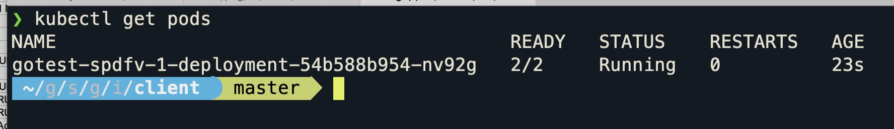
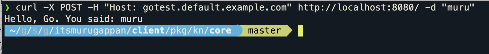

# Getting started with knative on your mac in 5 minutes

This guide will help you get started with knative on your mac in minutes

### PreReqs

* Docker running on your machine
* kubectl
* brew

### Components involved

* Kind (kubernetes in docker)
* Istio
* Knative
* KN cli

### Getting started

#### 1. Kind

Install kind following the steps [here](https://github.com/kubernetes-sigs/kind).

```bash
$ brew install kind
```

#### 2. Knative and Istio

Run the Makefile to install istio (1.5.1) and knative (0.15) 

```
$ make
```

Please note : There is an open [issue](https://github.com/istio/istio/issues/22463) which might prevent containers to start. please run the below command to restart istiod

```
kubectl -n istio-system rollout restart deployment istiod
```

#### 3. KN CLI

Follow the steps [here](https://github.com/knative/client/blob/master/docs/README.md) to install kn

#### 4. Create the service

```
$ kn service create gotest --image=murugappans/goswaggertest
```

#### 5. Call the service

```
$ kubectl port-forward svc/istio-ingressgateway -n istio-system 8080:80 &

# in new terminal

$ curl -X POST -H "Host: gotest.default.example.com" http://localhost:8080/
```




#### Cleanup

```
$ Kind delete cluster
```

